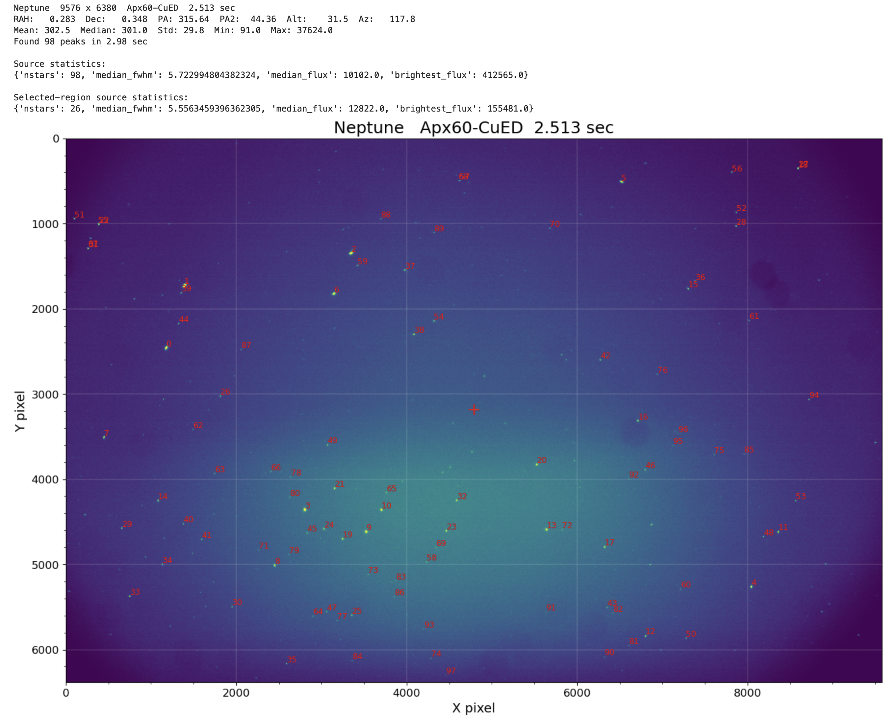
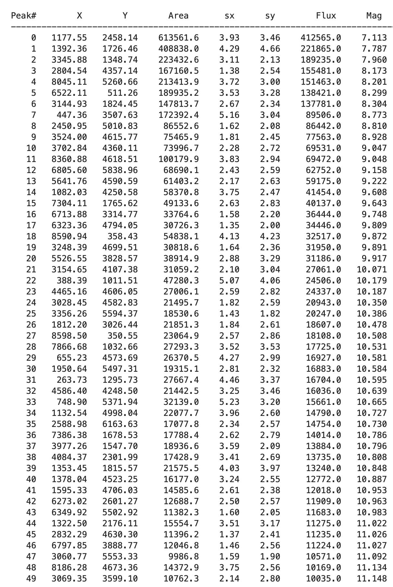
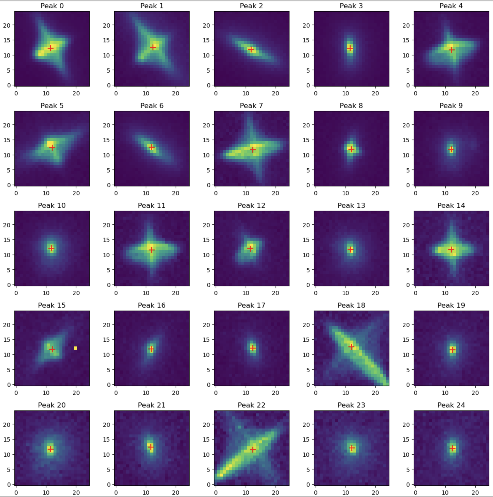
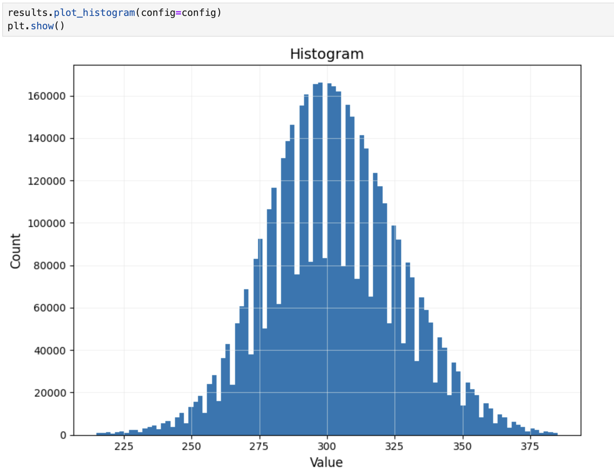

# CuRIOS FITS Imaging

Python tools for reading, analyzing, and visualizing astronomical FITS images acquired with the CuRIOS imaging system.

The package provides a modern workflow for:

- Reading FITS images
- Detecting stellar sources
- Measuring centroids and photometry
- Displaying publication-quality image plots
- Inspecting source cutouts
- Performing basic PSF diagnostics
- Exporting measurements for further analysis

The project is designed to be used from Jupyter Lab today and will evolve into a standalone scientific workbench with both command-line and graphical interfaces.

---

## Example

```python
from fits_imaging.config import ImagingConfig
from fits_imaging.session import ImagingSession

config = ImagingConfig()
session = ImagingSession()

results = session.analyze(config)
results.report(config=config)
```

---

## Screenshot








---

## Features

- FITS image I/O
- Automatic source detection
- Gaussian and moment-based centroid estimation
- Instrumental photometry
- Image statistics
- Region-based statistics
- Image cutouts
- Peak tables
- CSV export
- Radial PSF profiles
- Encircled-energy calculations
- Persistent imaging sessions
- Configurable plotting styles

---

## Repository Layout

```
curios-fits-imaging/

├── fits_imaging/
│   ├── analysis.py
│   ├── config.py
│   ├── diagnostics.py
│   ├── export.py
│   ├── fits_io.py
│   ├── models.py
│   ├── peak_finding.py
│   ├── photometry.py
│   ├── plotting.py
│   ├── plot_style.py
│   ├── psf.py
│   ├── report.py
│   ├── regions.py
│   └── session.py
│
├── notebooks/
├── examples/
├── tests/
├── README.md
└── CHANGELOG.md
```

---

## Installation

Clone the repository

```bash
git clone https://github.com/<your-account>/curios-fits-imaging.git
cd curios-fits-imaging
```

Create a virtual environment

```bash
python3.12 -m venv .venv
source .venv/bin/activate
```

Install the scientific packages

```bash
pip install numpy scipy matplotlib astropy photutils pandas numba jupyterlab
```

*(Future releases will support installation with `pip install -e .`.)*

---

## Typical Workflow

1. Start Jupyter Lab.
2. Open the analysis notebook.
3. Select an observing folder.
4. Select a FITS image.
5. Run the analysis.
6. Inspect the generated report.
7. Export results if desired.

---

## Development Status

Current release:

**Version 2.8**

Implemented

- ImagingResults API
- Session management
- Quick-look report
- Region-aware statistics
- PSF diagnostics
- CSV export

Planned

- WCS support
- Batch processing
- Scientific workbench
- Qt GUI

---

## License

(To be added.)

---

## Author

Steven Beckwith

CuRIOS Imaging Project
